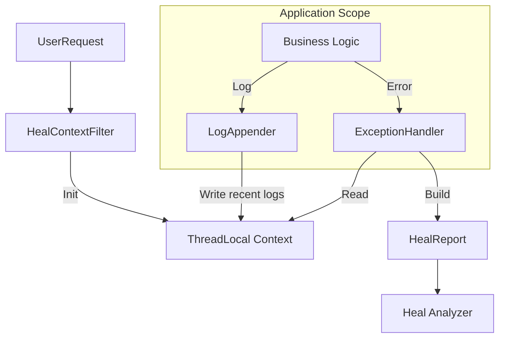

# Phase 7 Design: 探针上下文增强与“黑匣子”机制

## 1. 背景与问题 (Background & Problem)

**当前现状**：
目前 HealFlow 的探针（`heal-analyzer` / `healflow-engine`）主要关注异常堆栈（StackTrace）本身。当异常发生时，生成的报告包含错误类型、消息和堆栈信息。

**痛点**：
在实际生产环境中，仅有堆栈信息往往不足以快速定位根因。
1.  **场景缺失**：由于缺乏 HTTP 上下文（URL、参数、Header），开发者不知道是哪个特定请求触发了 Bug。
2.  **决策困难**：LLM 在分析时，如果不知道输入参数是什么，很难给出具体的修复建议（例如数据校验失败还是逻辑错误）。
3.  **日志断层**：看到错误，但无法关联到该请求之前的业务日志，导致难以还原案发现场。
4.  **传输顾虑**：完整的日志链路可能非常庞大，直接包含在 Prompt 或 HTTP 上报中会导致 Token 溢出或网络拥塞。

## 2. 设计目标 (Design Goals)

1.  **全景还原**：在异常发生瞬间，捕获尽可能多的“案发现场”信息（HTTP 请求、关键参数、TraceID）。
2.  **轻量级快照**：引入“黑匣子（Flight Recorder）”机制，仅在出错时保留最近的关键日志（环形缓冲），而非全量日志。
3.  **可观测性关联**：提供 TraceID 或日志系统链接，打通与现有监控系统（ELK/SkyWalking）的壁垒。
4.  **安全合规**：必须具备敏感信息脱敏能力（密码、Token、PII）。

## 3. 核心设计方案 (Core Design)

本方案整合了 **快照模型 (Snapshot Model)** 与 **日志引用 (Log Reference)** 两种思路。

### 3.1 数据模型扩展 (Data Model Extension)

我们将扩展 `HealContext`，使其包含一个子结构 `ExecutionContext`。

| 字段名 | 类型 | 描述 | 来源 |
| :--- | :--- | :--- | :--- |
| **request** | `RequestInfo` | HTTP 请求详情 | Servlet/Filter |
| **trace** | `TraceInfo` | 链路追踪标识 | MDC / Tracer |
| **logs** | `List<LogEntry>` | 关键日志快照（最近 N 条） | RingBufferAppender |
| **environment** | `EnvInfo` | 运行时环境（版本、节点） | System Props |

#### JSON 结构预览
```json
{
  "error": { ... }, // 原有异常信息
  "context": {
    "request": {
      "url": "/api/order/create",
      "method": "POST",
      "headers": { "User-Agent": "Mozilla/...", "X-Request-ID": "abc-123" },
      "queryParams": { "type": "vip" },
      "bodySnippet": "{\"skuId\": 1001, \"count\": -5}..." // 截断并脱敏
    },
    "trace": {
      "traceId": "a1b2c3d4",
      "spanId": "e5f6g7h8"
    },
    "logs": [
      { "level": "INFO", "msg": "Checking inventory for SKU 1001" },
      { "level": "WARN", "msg": "Inventory low" }
    ]
  }
}
```

### 3.2 数据收集策略 (Data Collection Strategy)

采用 **ThreadLocal "黑匣子" (Flight Recorder)** 模式。数据存储在当前线程的 ThreadLocal 中，请求结束或异常处理完毕后清理。

1.  **入口 (Entry)**: `HealContextFilter` 初始化 ThreadLocal，记录 URL、Method、Headers。
2.  **过程 (Process)**:
    *   **业务上下文**: 允许业务代码显式调用 `HealFlow.addContext("key", "value")`。
    *   **日志**: 通过自定义 Appender 将日志写入当前线程的环形缓冲区（RingBuffer）。
3.  **异常 (Error)**: 当 `HealFlowExceptionResolver` 捕获异常时，触发 `Snapshot` 动作，将 ThreadLocal 中的数据固化到 Report 中。
4.  **出口 (Exit)**: 清理 ThreadLocal，防止内存泄漏。

### 3.3 日志链路处理 (Log Handling)

针对“完整日志太长”的问题，采用混合策略：

| 方案 | 描述 | 适用场景 | 优缺点 |
| :--- | :--- | :--- | :--- |
| **方案 A: 环形缓冲 (Ring Buffer)** | 在内存中保留当前请求最近的 10-20 条日志。 | 快速诊断、单机应用 | ✅ 零依赖，立即见效 <br> ❌ 无法看到跨服务日志 |
| **方案 B: 日志引用 (Reference)** | 仅记录 TraceID 和日志查询链接 (URL Template)。 | 分布式微服务 | ✅ 数据量极小，关联现有基建 <br> ❌ 依赖外部日志系统 |
| **方案 C: 关键事件 (Key Events)** | 只记录 WARN/ERROR 级别或特定标记的日志。 | 高负载生产环境 | ✅ 降噪 <br> ❌ 可能丢失上下文 |

**最终决策**：**默认启用方案 A (Ring Buffer, limit=20)**，同时支持 **方案 B (TraceID)**。这样既能立刻看到错误前的操作，又能通过 ID 去查全量链路。

### 3.4 敏感信息脱敏 (Data Masking)

在收集参数（Query Param, Header, Body）时，必须经过脱敏层。

*   **策略**：基于 Key 的正则匹配。
*   **默认规则**：`password`, `token`, `secret`, `credential`, `mobile`, `creditCard`.
*   **处理**：替换为 `******`。

## 4. 技术实现方案 (Technical Implementation)

### 4.1 架构组件



### 4.2 关键代码结构预览

#### 4.2.1 上下文持有者 (`HealContextHolder`)

```java
public class HealContextHolder {
    private static final ThreadLocal<ExecutionContext> STORAGE = new ThreadLocal<>();

    public static void init(HttpServletRequest request) {
        ExecutionContext ctx = new ExecutionContext();
        ctx.recordRequest(request); // 记录 URL, Method, Header
        STORAGE.set(ctx);
    }

    // 记录日志到环形缓冲
    public static void appendLog(String level, String message) {
        ExecutionContext ctx = STORAGE.get();
        if (ctx != null) {
            ctx.getLogBuffer().add(new LogEntry(level, message));
        }
    }
    
    public static ExecutionContext snapshot() {
        return STORAGE.get(); // 返回当前快照
    }
    
    public static void clear() {
        STORAGE.remove();
    }
}
```

#### 4.2.2 过滤器 (`HealContextFilter`)

```java
public class HealContextFilter implements Filter {
    @Override
    public void doFilter(ServletRequest req, ServletResponse res, FilterChain chain) {
        try {
            HealContextHolder.init((HttpServletRequest) req);
            chain.doFilter(req, res);
        } finally {
            // 确保清理，但在清理前，GlobalExceptionHandler 可能已经读取了数据
            HealContextHolder.clear();
        }
    }
}
```

#### 4.2.3 日志集成 (Logback Appender 示例)

```xml
<!-- logback-spring.xml -->
<appender name="HEAL_BUFFER" class="com.healflow.agent.log.RingBufferAppender">
    <limit>20</limit> <!-- 只保留最后 20 条 -->
</appender>

<root level="INFO">
    <appender-ref ref="CONSOLE" />
    <appender-ref ref="HEAL_BUFFER" />
</root>
```

## 5. 分阶段实现路径 (Implementation Roadmap)

### Phase 7.1: MVP (核心价值)
*   **目标**：解决“不知道是什么参数报错”的问题。
*   **功能**：
    *   实现 `HealContextHolder` 和 `ThreadLocal` 存储。
    *   实现 `HealContextFilter` 捕获 URL、Method、QueryParams。
    *   集成到 `GlobalExceptionHandler`，在报告中附加 HTTP 信息。
    *   简单的 Body 截断（前 1KB）。

### Phase 7.2: V1.1 (日志与链路)
*   **目标**：解决“不知道报错前发生了什么”的问题。
*   **功能**：
    *   实现 `RingBufferAppender` (适配 Logback/Log4j2)。
    *   集成 TraceID (MDC 获取)。
    *   实现敏感信息脱敏配置。

### Phase 7.3: V2.0 (高级特性)
*   **目标**：深度集成与交互。
*   **功能**：
    *   支持 Request Body 的流式读取（Wrapper 解决 InputStream 只能读一次的问题）。
    *   支持外部日志链接模版配置（如 `https://kibana.internal/app/discover?q={traceId}`）。

## 6. 风险评估与缓解 (Risk & Mitigation)

| 风险点 | 影响 | 缓解措施 |
| :--- | :--- | :--- |
| **内存泄漏** | ThreadLocal 未清理会导致 OOM | 使用 `try-finally` 块确保在 Filter 最终处必然清理；使用 WeakReference 作为双重保障（可选）。 |
| **性能损耗** | 记录过多日志或大 Body 影响吞吐 | 默认关闭 Body 记录或限制大小（1KB）；日志环形缓冲仅保存引用或短字符串；异步处理快照构建。 |
| **数据泄露** | 敏感数据上报给 LLM | 强制开启默认脱敏规则；提供正则白名单/黑名单配置；在 LLM Prompt 中增加指令让 AI 忽略疑似敏感信息。 |
| **InputStream 消费** | 读取 Body 导致业务逻辑无法再次读取 | 使用 `ContentCachingRequestWrapper` (Spring) 或自定义 Wrapper 缓存 Body 内容。 |

## 7. 配置示例 (Configuration)

在 `application.yml` 中：

```yaml
healflow:
  context:
    enabled: true
    capture-body: true
    max-body-size: 1024 # 1KB
    sensitive-keys: 
      - password
      - token
      - secret
    log:
      enabled: true
      buffer-size: 20 # 保留最近 20 条日志
      mdc-trace-key: "traceId" # MDC 中 TraceID 的键名
```
